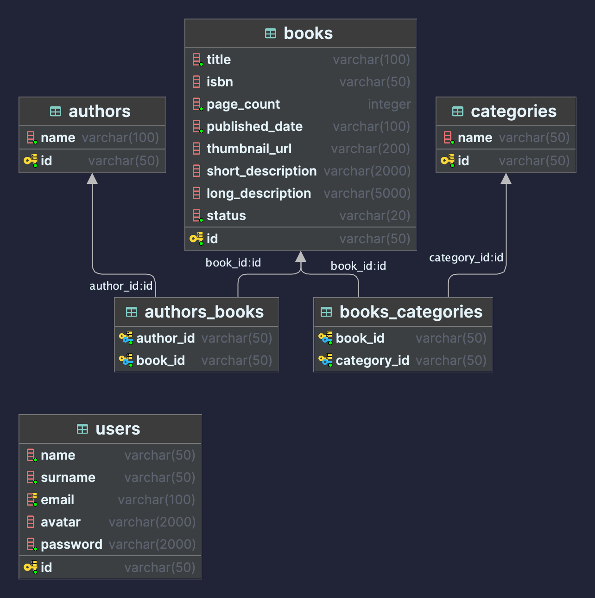

# Readconnect Backend

Este repositorio corresponde al backend de la aplicación Readconnect, el repositorio del frontend puede ser encontrando
en el siguiente [enlace](https://github.com/YeisonKirax/readconnect-frontend). Para usar el demo dirigirse a:

## [DEMO](https://readconnect-front-dev.onrender.com)

## [DEMO API](https://readconnect-backend-dev.onrender.com/docs)

# Stack

El frontend fue construido usando:

* NodeJS 18
* Typescript
* NextJS 14
* React 18
* NextAuth
* DaisyUI
* TaildwindCSS

El backend fue construido usando:

* Python 3.10
* FastAPI
* SQLAlchemy
* Postgresql 15
* Poetry
* Swagger

El despliegue fue realizado en [render](https://render.com).

# Funcionalidades implementadas

* Login.
* Registro.
* Listado de libros con páginación.
* Búsqueda de libros (por título o isbn)
* Ver un libro
* Ruta para poblar la base de datos.

# Base de datos

Para la construcción de la base de datos, se tomó como base el dataset de libros de [amazon](https://github.com/dudeonthehorse/datasets/blob/master/amazon.books.json)

Pero se realizaron algunas modificaciones al momento de construir la base. Se cambió los id's a un formato de string y fueron remplzados por nano id's y se seleccionaron los 301 primeros libros. A partir de esta base se generaron las tablas y relaciones. El siguiente diagrama ejemplifica como quedó la base de datos.

Lamentablemente, no se encuentra completa dado que no se alcanzó a realizar las funcionalidades que involucraban a los usuarios.
